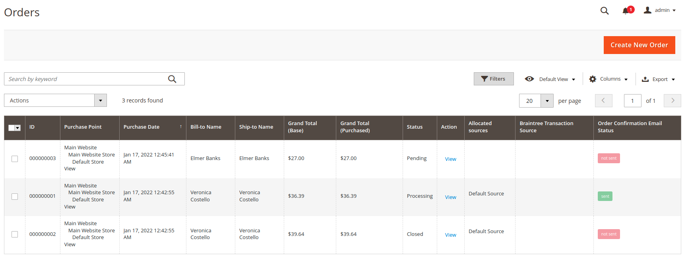

# Magento 2 Module: OrderConfirmationEmailStatus

 - [Main Functionalities](#markdown-header-main-functionalities)
 - [Installation](#markdown-header-installation)

## Main Functionalities
This module adds a column in the sales order grid showing the status of the order confirmation email.

## Installation
\* = in production please use the `--keep-generated` option

### Type 1: Composer (recommended)

 - Install the module composer by running `composer require sndsabin/module-orderconfirmationemailstatus`
 - Enable the module by running `php bin/magento module:enable SNDSABIN_OrderConfirmationEmailStatus`
 - Apply database updates by running `php bin/magento setup:upgrade`\*
 - Flush the cache by running `php bin/magento cache:flush`

### Type 2: Zip file

 - Unzip the zip file in `app/code/SNDSABIN`
 - Enable the module by running `php bin/magento module:enable SNDSABIN_OrderConfirmationEmailStatus`
 - Apply database updates by running `php bin/magento setup:upgrade`\*
 - Flush the cache by running `php bin/magento cache:flush`

## License
[GPL](LICENSE.txt)

##### Uppercase Vendor Name 😛 ?
Yes 😄

**Bootstrapped using [Mage2Gen](https://mage2gen.com)**

